# Bildschirm-Designs

Alle Bilder sind **nicht gemalt**, sondern aus dem echten Zeichencode in
`xiao_epaper_test/src/main.cpp` erzeugt (PC-Simulator, siehe
`tools/simulator/README.md`). Sie zeigen also exakt, was das 250 x 122 Pixel
große E-Paper-Display zeigt, inklusive der echten Schriften.

Neu erzeugen: `powershell -File tools\simulator\simulate.ps1`

## Ablauf beim Start

| Nr. | Bildschirm | Normalfall | Fehlerfall |
| --- | --- | --- | --- |
| 1 | Startbild | 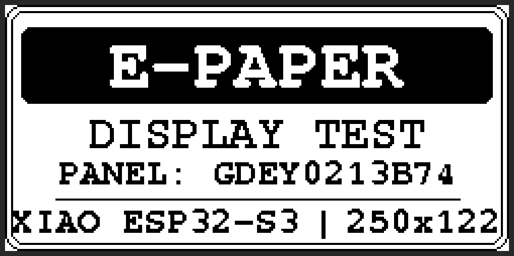 | — |
| 2 | Grafik-/Kontrasttest (Endbild der Animation) | 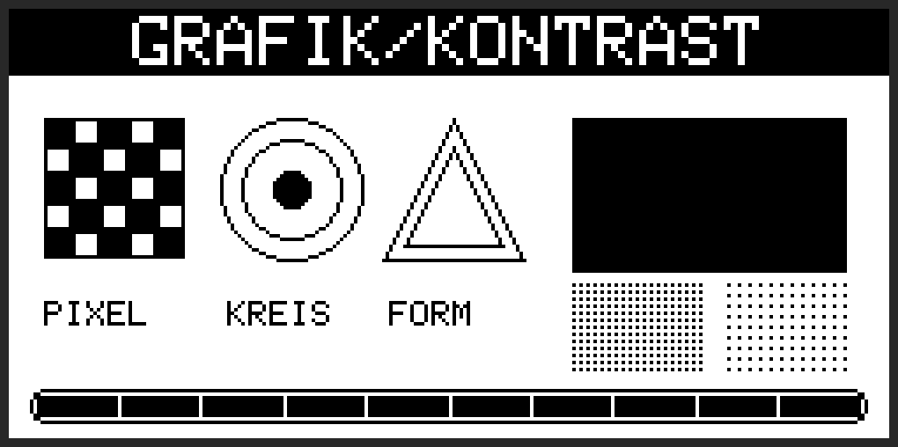 | — |
| 3 | Akku-Prüfung (1/3) | 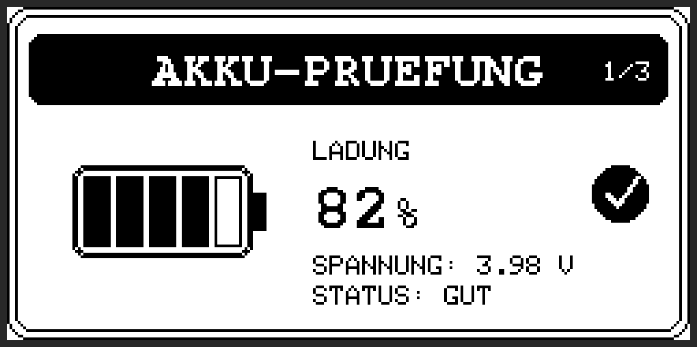 | 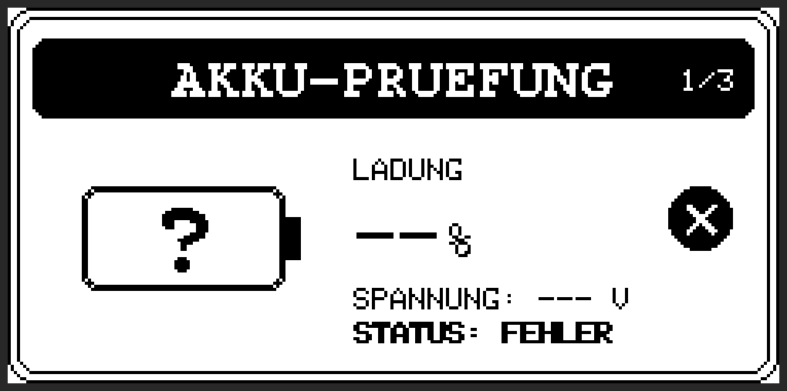 |
| 4 | Sensor-Prüfung (2/3) | 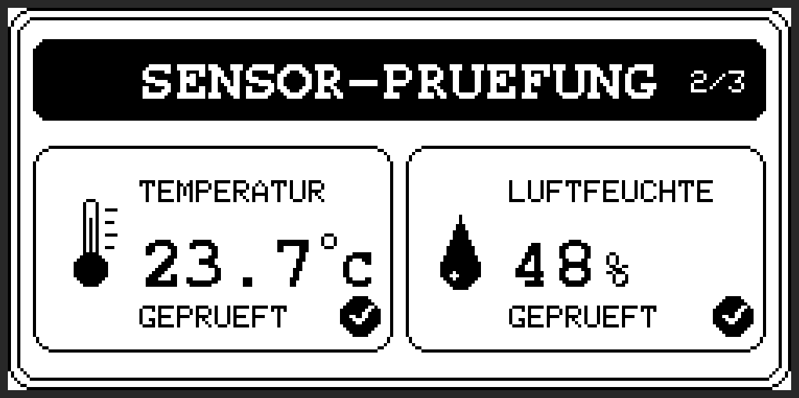 | Luftfeuchtigkeit fällt aus: 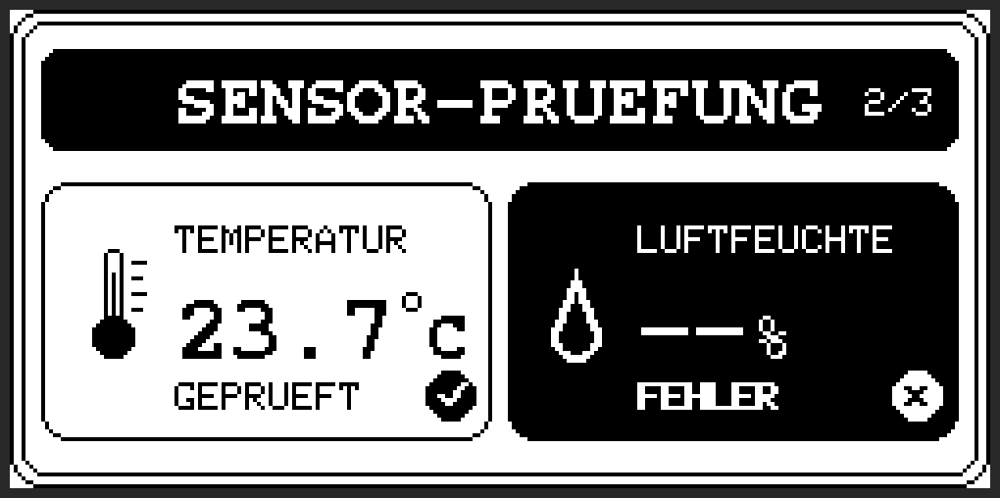 |
| 4 | Sensor-Prüfung, beide Sensoren fallen aus | — | 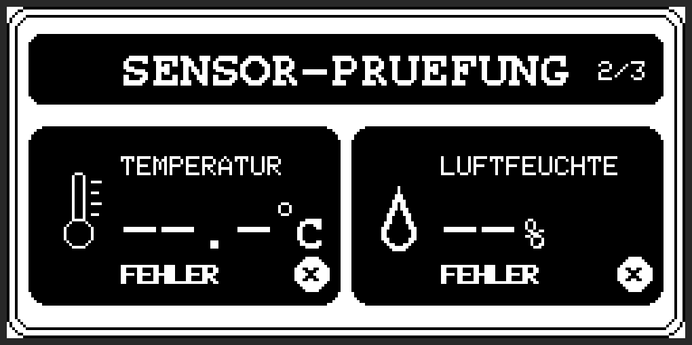 |
| 5 | WLAN-Prüfung (3/3) | 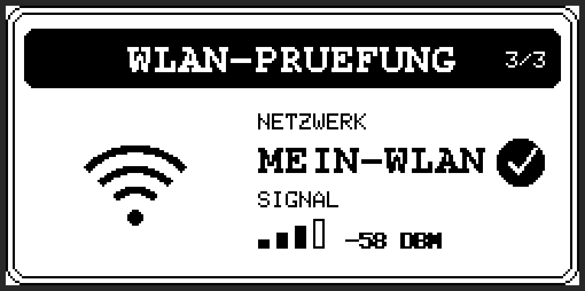 | 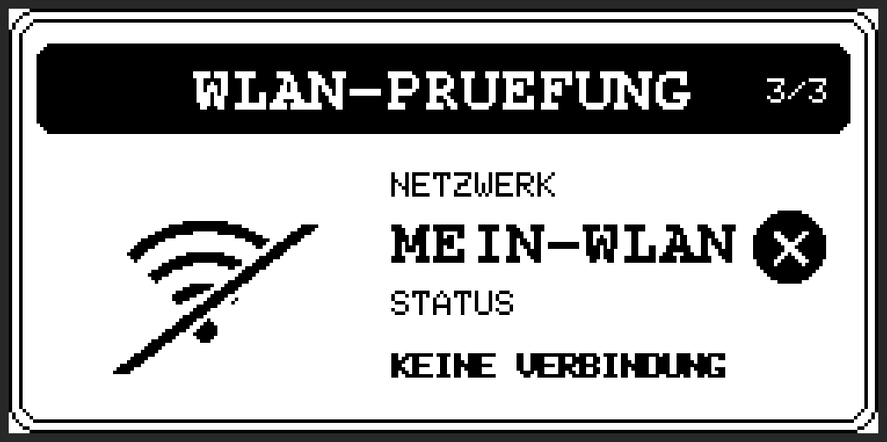 |
| 6 | Zusammenfassung | "Test erfolgreich": 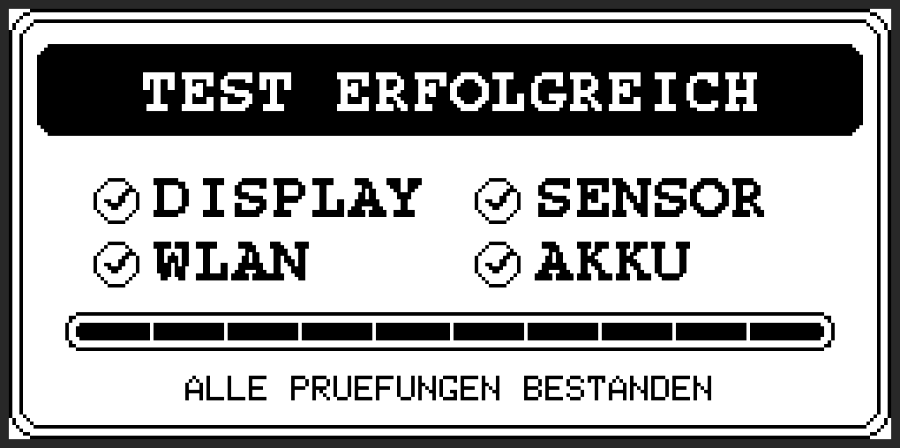 | "Test mit Fehlern": 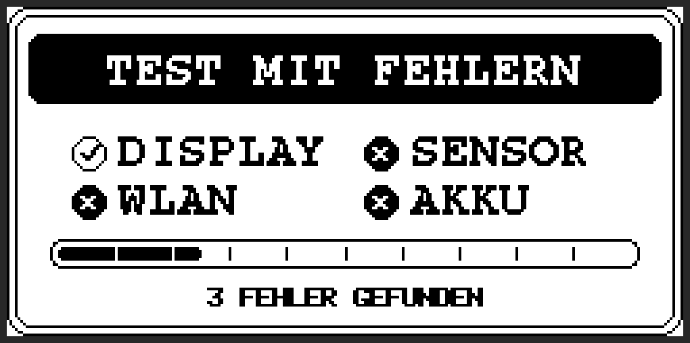 |
| 7 | Status-Dashboard | 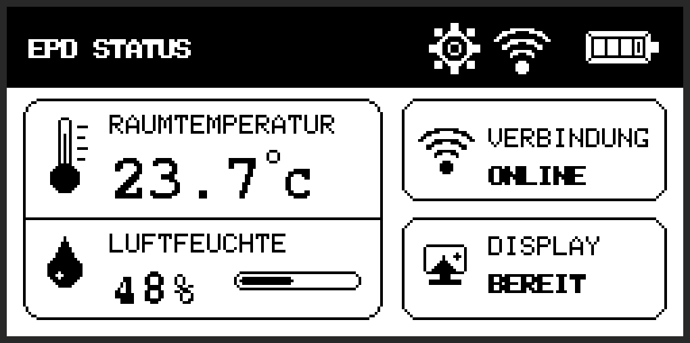 | Akku, Luftfeuchtigkeit, WLAN fallen aus: 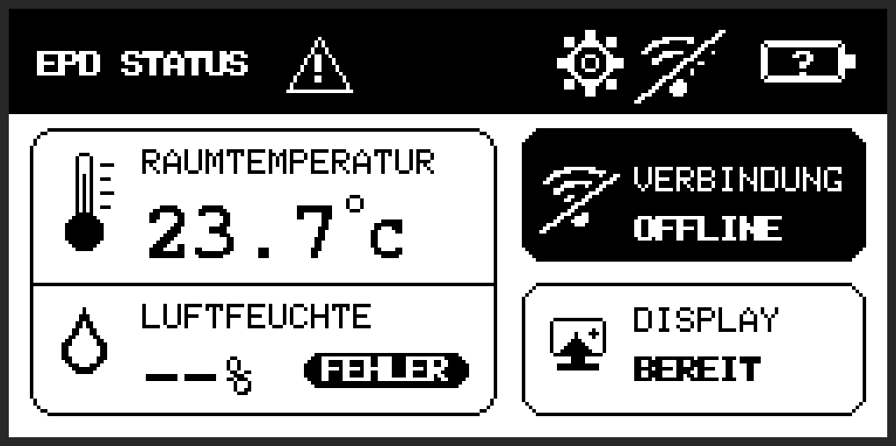 |
| 7 | Status-Dashboard, alle Messungen fallen aus | — | 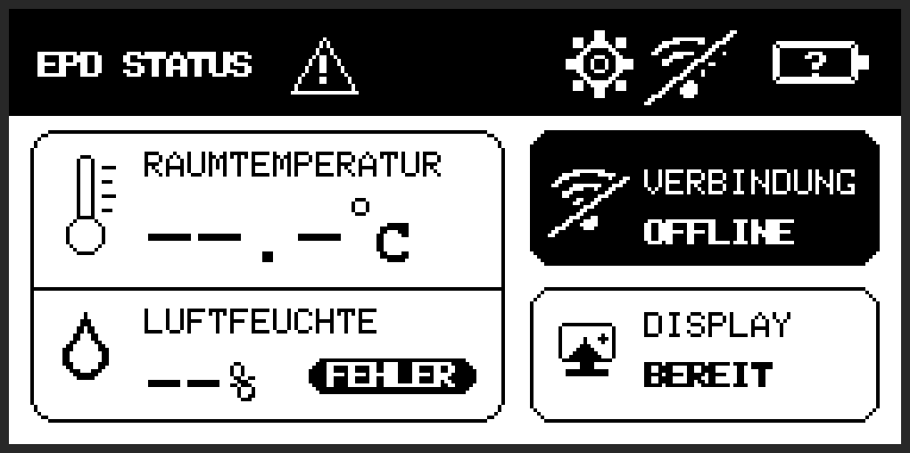 |
| 8 | Optionen (unverändert) | 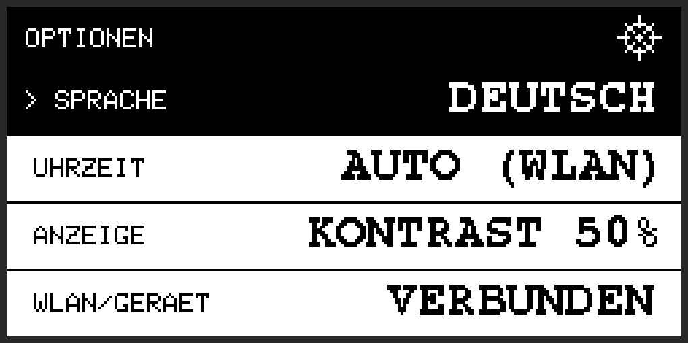 | — |

## Gestaltungsregeln, die im Gespräch festgelegt wurden

- Dashboard: große Box links (oben Temperatur, unten Luftfeuchtigkeit), rechts
  zwei Statusfelder (Verbindung, Display). Keine Fußzeile mehr.
- Die Trennlinie zwischen Temperatur und Luftfeuchtigkeit läuft **durchgehend
  von Rand zu Rand**.
- Die Prüfbilder (Akku, Sensoren, WLAN) und die Zusammenfassung teilen sich
  Rahmen und Titelbalken mit dem Startbild.
- Erfolg = Haken (Umriss oder schwarzer Kreis), Fehler = schwarzer Kreis mit
  Kreuz bzw. **invertierte** (schwarze) Fläche mit weißer Schrift.
- Fehlender Messwert = `--` (Temperatur `--.-`), Umriss-Symbol statt gefülltem
  Symbol, im Akku ein `?`, durchgestrichenes WLAN-Symbol, Warndreieck in der
  Kopfzeile des Dashboards.
